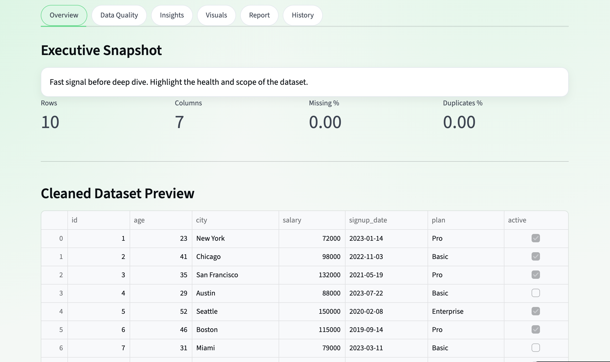
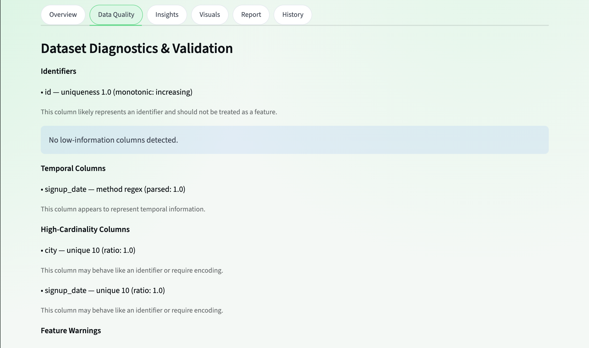
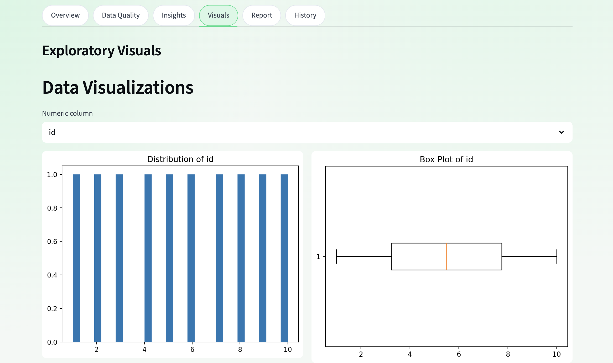
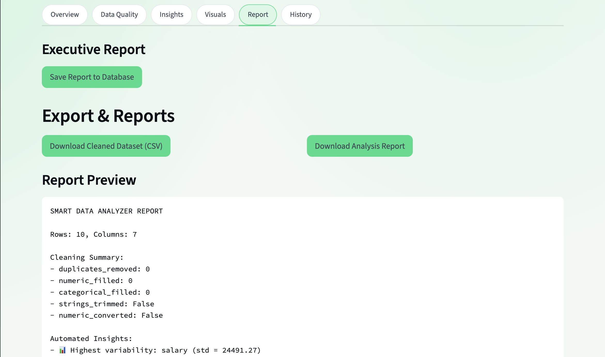

# Data Health Console

A Streamlit application for quick dataset triage before deeper analysis or modeling.

This project focuses on a practical question: is a CSV structurally healthy enough to trust? It lets you upload a dataset, apply a small cleaning pipeline, inspect validation warnings, review a heuristic quality score, and export a text report or cleaned CSV.

It is not a production data quality platform. The diagnostics are rule-based heuristics designed for small-to-medium tabular datasets, and the repository now makes that explicit.

## Live Demo

[Open the app](https://data-analyzer-s6jcpxygphyuv5rwxcmozt.streamlit.app/)

## Screenshots






## What It Does

- Upload a CSV or load a built-in sample dataset
- Apply optional cleaning steps:
  - trim string columns
  - fill missing numeric values with medians
  - fill missing categorical values with `"Unknown"`
  - auto-convert numeric-looking columns
  - drop duplicate rows
- Run validation checks for:
  - identifier-like columns
  - constant or near-constant columns
  - datetime-like columns
  - high-cardinality categoricals
  - numeric columns that likely behave as categories
  - numeric distribution warnings
- Compute a heuristic 0-100 data quality score
- Generate a plain-text report
- Persist cleaned snapshots and saved reports in SQLite

## Why This Project Is Useful

Many early analytics mistakes come from dataset quality issues rather than model choice:

- IDs get treated as features
- datelike text is left unparsed
- duplicate rows distort counts
- missing values are ignored until late
- low-information columns waste attention

This app is intended to catch those problems early and make them visible in a lightweight workflow.

## Project Scope

This repository is strongest as:

- a well-scoped data quality and profiling project
- a modular Python app with UI, service layer, validation logic, persistence, and tests
- a concrete example of turning data heuristics into a usable product workflow

This repository is not trying to be:

- a full observability platform
- a distributed ETL system
- a statistically rigorous substitute for domain-specific validation

## Repository Highlights

- Modularized logic across `services/`, `ui/`, `validation.py`, and `storage.py`
- Persistent storage with SQLite for datasets, cleaned snapshots, and reports
- Sample datasets in `sample_datasets/` for regression coverage
- Automated tests for cleaning, validation, scoring, and reporting
- GitHub Actions CI to run the test suite on push and pull request

## Example Project Structure

```text
app.py
storage.py
validation.py
requirements.txt
Makefile
README.md
.streamlit/config.toml
.github/workflows/ci.yml

app/
  theme.css

sample_datasets/
  customer_profiles.csv
  messy_orders.csv

services/
  analytics.py
  cleaning.py
  reporting.py

tests/
  conftest.py
  test_cleaning.py
  test_quality_score.py
  test_reporting.py
  test_validation.py

ui/
  sidebar.py
  sections.py
```

## Running Locally

```bash
python3 -m venv venv
source venv/bin/activate
pip install -r requirements.txt
streamlit run app.py
```

Open `http://localhost:8501`

You can also use:

```bash
make install
make test
make run
```

## Tests

Run the test suite with:

```bash
pytest
```

Current coverage is focused on:

- cleaning behavior
- validation false positives and expected detections
- quality score directionality
- report generation

## Sample Data

The repository includes small CSV fixtures for repeatable checks:

- `sample_datasets/customer_profiles.csv`
- `sample_datasets/messy_orders.csv`

These are used by the tests to verify that:

- obvious identifiers are detected without flagging `age` or `salary`
- date columns are detected without classifying arbitrary numeric columns as temporal
- messy data scores worse than cleaner data

## Technical Notes

- UI framework: Streamlit
- Analysis stack: Pandas, NumPy, Matplotlib
- Storage: SQLite via `sqlite3`
- Validation logic: heuristic and rule-based, not ML-driven
- Reports: plain-text summaries intended for fast review, not formatted business deliverables

## Limitations

- Validation rules are heuristic and may still need tuning for domain-specific datasets
- The quality score is intentionally interpretable, but not statistically calibrated
- Persistence is local SQLite only
- The app is designed for local use and portfolio demonstration, not multi-user deployment

## Next Upgrades That Would Increase Resume Value

- config-driven validation rules instead of hard-coded thresholds
- richer report output such as HTML or PDF
- dataset-to-dataset comparison or drift views
- stronger test coverage around persistence and edge-case parsing
- typed models for report and validation outputs

## Author

Built by Angad Singh.
